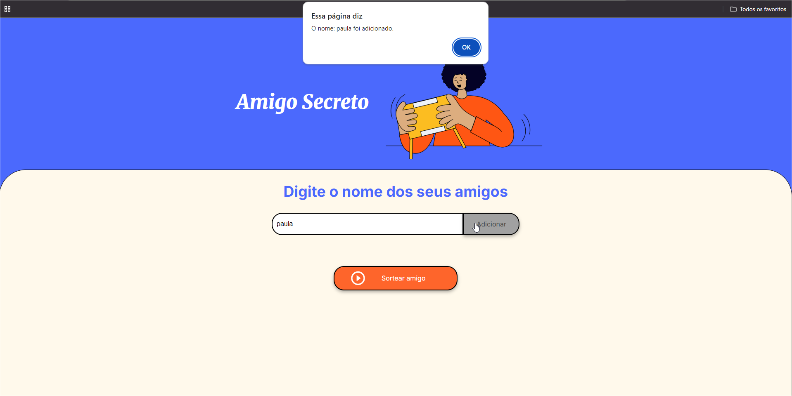
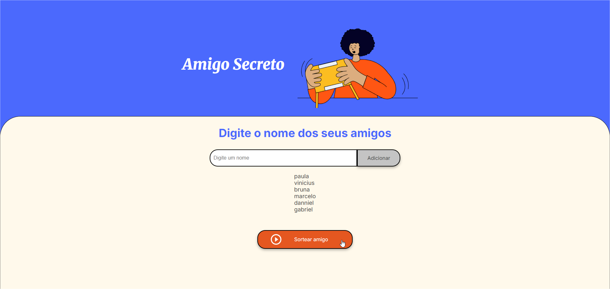
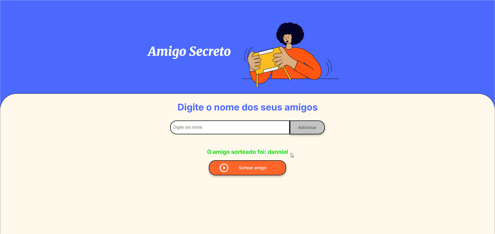
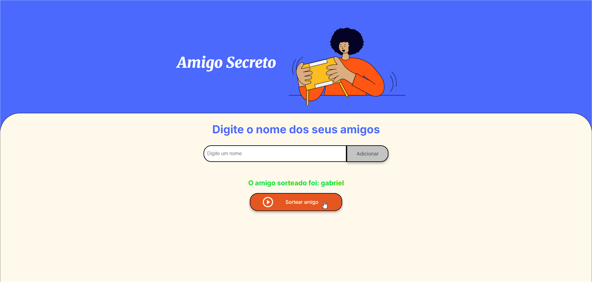

# Projeto ONE - Oracle & Alura - Desafio Amigo Secreto

> O projeto é um sorteador aleatório de amigo secreto.

## Como funciona:

*   A ideia é digitar uma lista de amigos e em seguida pressionar o botão sortear um amigo na tela principal da aplicação.

## Aprendizados aplicados:

*  Variáveis.
*  Arrays.
*  Caixas de mensagem.
*  Console do Navegador.  
*  Condicional.
*  Loops.
*  Funções.

## Tecnologias Utilizadas:

*   HTML
*   CSS
*   JavaScript

## Desenvolvedor:

* Bruno Carvalho

## Onde encontrar:

*   [GitHub](https://github.com/brunodsh/projeto-one-challenge-amigo-secreto)

## 4 passos para sortear o Amigo Secreto

> Escreva o nome, click em adicionar e confirme na caixa de mensagem:

> Conforme escreve, vai sendo adicionado os nomes a lista que será sorteada:

> Agora click em Sortear Amigo no botão laranja:

> Se continuar clicando no botão laranja, vai fazendo novos sorteios:

 

#  _Divirtam-se!!!_
